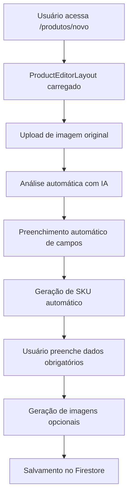
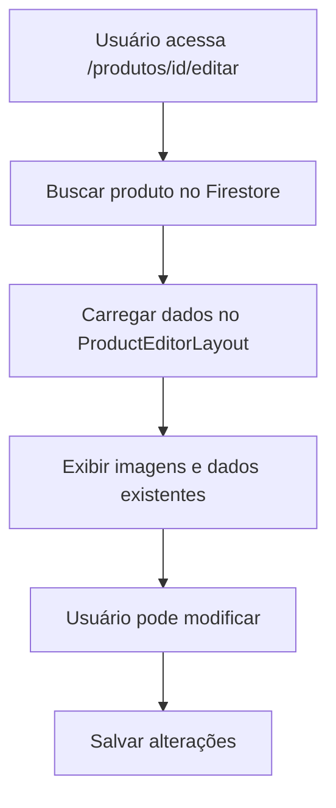

# 📋 RELATÓRIO COMPLETO - SISTEMA DE PRODUTOS

## 📑 Índice
1. [Visão Geral](#visão-geral)
2. [Estrutura de Arquivos](#estrutura-de-arquivos)
3. [Fluxo de Funcionamento](#fluxo-de-funcionamento)
4. [Análise Inteligente com IA](#análise-inteligente-com-ia)
5. [Geração de Imagens com IA](#geração-de-imagens-com-ia)
6. [Guia de Medidas Sugerido](#guia-de-medidas-sugerido)
7. [Validações e Preenchimento Obrigatório](#validações-e-preenchimento-obrigatório)
8. [Geração Automática de SKU](#geração-automática-de-sku)
9. [Sistema de Variações](#sistema-de-variações)
10. [APIs e Endpoints](#apis-e-endpoints)
11. [Código Detalhado](#código-detalhado)

---

## 🎯 Visão Geral

O sistema de produtos é uma solução completa para gerenciamento de produtos em e-commerce, integrando:
- **Análise automática de imagens** com IA (Gemini Vision)
- **Geração de imagens de catálogo** com IA (Imagen 3)
- **Geração de looks combinados** com produtos complementares
- **Sugestão inteligente de guias de medidas** baseada na análise
- **Preenchimento automático de campos** com dados da IA
- **Validação de campos obrigatórios**
- **Geração automática de SKU**

### Páginas Principais
- **Adicionar Produto**: `/produtos/novo`
- **Editar Produto**: `/produtos/[id]/editar`

---

## 📁 Estrutura de Arquivos

### Componentes Principais
```
src/
├── components/admin/products/
│   ├── ProductEditorLayout.tsx      # Componente principal do editor
│   ├── MeasurementGuideCard.tsx     # Card de guia de medidas
│   ├── ManualCombinationModal.tsx   # Modal para combinação manual
│   └── VariacaoRow.tsx              # Linha de variação (interno)
│
├── app/(lojista)/produtos/
│   ├── novo/page.tsx                # Página de novo produto
│   ├── [id]/editar/page.tsx          # Página de editar produto
│   └── products-table.tsx            # Tabela de listagem
│
├── app/api/lojista/products/
│   ├── analyze/route.ts              # API de análise com IA
│   ├── generate-studio/route.ts      # API de geração de imagens
│   ├── upload-image/route.ts         # API de upload de imagens
│   └── route.ts                      # CRUD de produtos
│
└── lib/
    ├── ai-services/
    │   ├── product-analyzer.ts       # Serviço de análise com Gemini
    │   └── mannequin-prompts.ts      # Prompts de manequins
    ├── ai/
    │   ├── imagen-generate.ts        # Geração de imagens com Imagen
    │   └── catalog-prompt.ts         # Construção de prompts
    └── data/
        └── measurementsManifest.ts   # Manifest de guias de medidas
```

---

## 🔄 Fluxo de Funcionamento

### 1. Adicionar Novo Produto



### 2. Editar Produto Existente



---

## 🤖 Análise Inteligente com IA

### Serviço: `ProductAnalyzerService`

**Arquivo**: `src/lib/ai-services/product-analyzer.ts`

#### Configuração
```typescript
const GEMINI_ANALYZER_CONFIG = {
  projectId: process.env.GOOGLE_CLOUD_PROJECT_ID,
  location: "us-central1",
  modelId: "gemini-2.5-flash", // Modelo GA estável
};
```

#### Fluxo de Análise

1. **Upload da Imagem**
   - Imagem é convertida para base64
   - Enviada para o Gemini Vision API

2. **Análise com Gemini**
   - O modelo analisa a imagem
   - Retorna JSON estruturado com:
     - `nome_sugerido`: Nome comercial do produto
     - `descricao_seo`: Descrição otimizada (máx. 470 caracteres)
     - `suggested_category`: Categoria consolidada
     - `product_type`: Tipo específico (ex: "Vestido Midi")
     - `detected_fabric`: Tecido detectado
     - `dominant_colors`: Array de cores com hex e nome
     - `logistic_unit`: Unidade de medida (UN, PAR, CJ, etc.)
     - `has_variations_likely`: Boolean indicando se tem variações
     - `tags`: Array de tags para contexto

3. **Tratamento de Erros JSON**
   - Múltiplas estratégias de reparação:
     - Correção de strings não terminadas
     - Remoção de caracteres de controle
     - Fechamento automático de chaves/colchetes
     - Extração manual de campos essenciais se necessário

#### Código Principal

```typescript
// Método principal de análise
async analyzeProductImage(imageUrl: string): Promise<APIResponse<ProductAnalysisResult>> {
  // 1. Obter token de acesso
  const accessToken = await this.getAccessToken();
  
  // 2. Converter imagem para base64
  const base64Data = await this.imageUrlToBase64(imageUrl);
  
  // 3. Executar análise (com retry em caso de erro)
  return await this.performAnalysis(accessToken, base64Data);
}

// Análise com prompt estruturado
private async performAnalysis(accessToken: string, base64Data: string) {
  const systemPrompt = `Você é um especialista em E-commerce de Moda e SEO...`;
  
  // Construir requisição para Gemini
  const requestBody = {
    contents: [{
      parts: [
        { text: systemPrompt },
        { 
          inline_data: {
            mime_type: "image/jpeg",
            data: base64Data
          }
        }
      ]
    }],
    generationConfig: {
      temperature: 0.4,
      topK: 32,
      topP: 1,
      maxOutputTokens: 2048,
      responseMimeType: "application/json"
    }
  };
  
  // Fazer requisição e processar resposta
  const response = await fetch(this.endpoint, {
    method: "POST",
    headers: {
      "Authorization": `Bearer ${accessToken}`,
      "Content-Type": "application/json",
    },
    body: JSON.stringify(requestBody),
  });
  
  // Extrair e parsear JSON (com tratamento robusto de erros)
  const responseData = await response.json();
  const textContent = responseData.candidates?.[0]?.content?.parts?.[0]?.text;
  
  // Sanitizar e corrigir JSON
  let jsonText = this.sanitizeAndFixJSON(textContent);
  
  // Parsear resultado
  const analysisResult = JSON.parse(jsonText);
  
  return {
    success: true,
    data: analysisResult,
    executionTime: Date.now() - startTime
  };
}
```

#### API Endpoint

**Rota**: `POST /api/lojista/products/analyze?lojistaId={id}`

**Request Body**:
```json
{
  "imageUrl": "https://..."
}
```

**Response**:
```json
{
  "success": true,
  "data": {
    "nome_sugerido": "Vestido Longo Floral",
    "descricao_seo": "...",
    "suggested_category": "Roupas",
    "product_type": "Vestido Midi",
    "detected_fabric": "Algodão",
    "dominant_colors": [
      { "hex": "#FF5733", "name": "Coral" }
    ],
    "logistic_unit": "UN",
    "has_variations_likely": true,
    "tags": ["verão", "casual", "floral"]
  },
  "executionTime": 3500
}
```

---

## 🎨 Geração de Imagens com IA

### Tipos de Geração

1. **Imagem de Catálogo** (`tipo: "catalog"`)
   - Produto isolado em manequim
   - Custo: 1 crédito ou 1 pack
   - Etiqueta com preço e tamanhos

2. **Look Combinado** (`tipo: "combined"`)
   - Produto principal + produtos complementares
   - Custo: 2 créditos ou 2 packs
   - Seleção automática ou manual de complementos

### Serviço: `generateCatalogImage`

**Arquivo**: `src/lib/ai/imagen-generate.ts`

#### Fluxo de Geração

1. **Preparação do Prompt**
   ```typescript
   // Construir prompt com:
   - Dados do manequim selecionado
   - Imagem original do produto
   - Etiqueta com preço e informações
   - Cenário contextual (praia, inverno, fitness, etc.)
   ```

2. **Geração com Imagen 3**
   ```typescript
   const imageUrl = await generateCatalogImage({
     prompt: promptFinal,
     imageUrl: imagemOriginal,
     aspectRatio: "3:4",
     safetyFilterLevel: "block_some",
     personGeneration: "allow_all"
   });
   ```

3. **Debito de Créditos**
   - Verifica saldo disponível
   - Debita créditos ou packs
   - Registra no histórico

#### API Endpoint

**Rota**: `POST /api/lojista/products/generate-studio?lojistaId={id}`

**Request Body**:
```json
{
  "produtoId": "abc123",
  "imagemUrl": "https://...",
  "mannequinId": "mannequin_01",
  "tipo": "catalog" | "combined",
  "nome": "Vestido Floral",
  "categoria": "Roupas",
  "preco": 199.90,
  "precoPromocional": 149.90,
  "productIds": ["prod1", "prod2"], // Apenas para "combined"
  "tags": ["verão", "casual"]
}
```

**Response**:
```json
{
  "imageUrl": "https://storage.googleapis.com/...",
  "creditsUsed": 1,
  "remainingCredits": 99
}
```

### Lógica de Look Combinado

#### Modo Automático

1. **Análise de Cenário**
   ```typescript
   // Extrair características do produto
   const caracteristicas = extractProductCharacteristics({
     categoria,
     product_type,
     tags,
     cores,
     tecido
   });
   
   // Selecionar cenário apropriado
   const scenario = selectScenarioForProduct(caracteristicas);
   // Retorna: "praia", "inverno", "fitness", "festa", "casual", etc.
   ```

2. **Busca de Produtos Complementares**
   ```typescript
   // Buscar produtos do mesmo lojista que combinem
   const produtosDisponiveis = await buscarProdutosComplementares({
     lojistaId,
     categoria,
     scenario,
     excludeProductId: produtoId
   });
   ```

3. **Seleção Inteligente pela IA**
   - A IA analisa o produto principal
   - Sugere produtos que combinam
   - Seleciona 1-3 produtos complementares

4. **Fallback**
   - Se IA não encontrar, usa produtos mais vendidos
   - Se não houver produtos, usa produtos genéricos do catálogo

#### Modo Manual

- Usuário seleciona produtos manualmente
- Modal com busca e filtros
- Seleção múltipla de produtos

---

## 📏 Guia de Medidas Sugerido

### Componente: `MeasurementGuideCard`

**Arquivo**: `src/components/admin/products/MeasurementGuideCard.tsx`

#### Lógica de Seleção

1. **Análise da Imagem Original**
   - IA retorna: `suggested_category`, `product_type`, `tags`

2. **Busca no Manifest**
   ```typescript
   const measurementItem = findMeasurementImage(
     aiCategory,      // Ex: "Roupas"
     aiProductType,   // Ex: "Vestido Midi"
     aiKeywords,      // Ex: ["verão", "floral"]
     isPlusSize       // Boolean
   );
   ```

3. **Algoritmo de Matching**
   - Filtra por `isPlusSize` (se fornecido)
   - Busca match exato na categoria
   - Se não encontrar, busca por keywords (pontuação)
   - Retorna item com maior pontuação

4. **Prioridade**
   - **1ª Prioridade**: Imagem customizada (upload manual)
   - **2ª Prioridade**: Imagem do manifest (baseada na análise)

#### Manifest de Medidas

**Arquivo**: `src/data/measurementsManifest.ts`

- 100+ tipos de produtos mapeados
- Cada item contém:
  - `id`: Identificador único
  - `filename`: Nome do arquivo PNG
  - `category`: Categoria (top, bottom, dress, etc.)
  - `keywords`: Palavras-chave para matching
  - `isPlusSize`: Flag para tamanhos plus

**Estrutura**:
```typescript
export interface MeasurementManifestItem {
  id: string;
  filename: string;
  category: string;
  keywords: string[];
  isPlusSize: boolean;
}

// Exemplo
{
  id: "std_01",
  filename: "top_camiseta_basica.png",
  category: "top",
  keywords: ["camiseta", "t-shirt", "básica"],
  isPlusSize: false
}
```

#### Função de Busca

```typescript
export function findMeasurementImage(
  category?: string,
  productType?: string,
  keywords?: string[],
  isPlusSize?: boolean
): MeasurementManifestItem | null {
  // 1. Filtrar por isPlusSize
  let filtered = isPlusSize !== undefined
    ? MEASUREMENTS_MANIFEST.filter(item => item.isPlusSize === isPlusSize)
    : MEASUREMENTS_MANIFEST;
  
  // 2. Buscar match exato na categoria
  if (category) {
    const categoryMatch = filtered.find(item => 
      item.category.toLowerCase() === category.toLowerCase()
    );
    if (categoryMatch) return categoryMatch;
  }
  
  // 3. Buscar por keywords (pontuação)
  if (keywords && keywords.length > 0) {
    let bestMatch: MeasurementManifestItem | null = null;
    let bestScore = 0;
    
    for (const item of filtered) {
      let score = 0;
      for (const keyword of keywords) {
        if (item.keywords.some(k => 
          k.toLowerCase().includes(keyword.toLowerCase())
        )) {
          score++;
        }
      }
      if (score > bestScore) {
        bestScore = score;
        bestMatch = item;
      }
    }
    
    if (bestMatch) return bestMatch;
  }
  
  return null;
}
```

---

## ✅ Validações e Preenchimento Obrigatório

### Campos Obrigatórios

**Arquivo**: `src/components/admin/products/ProductEditorLayout.tsx`

#### Validação no Salvamento

```typescript
const handleSave = async () => {
  // 1. Imagem original obrigatória
  if (!state.rawImageUrl) {
    alert("Por favor, faça upload de uma imagem.");
    return;
  }

  // 2. Nome do produto obrigatório
  if (!state.aiAnalysisData?.nome_sugerido) {
    alert("Por favor, aguarde a análise da IA ou preencha o nome do produto.");
    return;
  }

  // 3. Preço obrigatório
  if (!state.manualData.preco) {
    alert("Por favor, preencha o preço do produto.");
    return;
  }

  // 4. SKU obrigatório (mas pode ser gerado automaticamente)
  if (!state.manualData.sku) {
    // Tentar gerar automaticamente
    if (state.aiAnalysisData?.nome_sugerido) {
      const skuGerado = generateMainSKU(state.aiAnalysisData.nome_sugerido);
      state.manualData.sku = skuGerado;
    } else {
      alert("Por favor, preencha o SKU do produto.");
      return;
    }
  }

  // 5. Validação de variações (se ativadas)
  if (state.temVariacoes) {
    const variacoesValidas = state.variacoes.filter(v => 
      v.variacao.trim() && v.estoque.trim()
    );
    
    if (variacoesValidas.length === 0) {
      alert("Por favor, adicione pelo menos uma variação válida.");
      return;
    }
  }

  // Prosseguir com salvamento...
};
```

#### Interface Visual

- Campos obrigatórios marcados com asterisco vermelho (`*`)
- Bordas vermelhas em campos obrigatórios
- Mensagens de erro claras
- Validação em tempo real

---

## 🔢 Geração Automática de SKU

### Função: `generateMainSKU`

**Arquivo**: `src/components/admin/products/ProductEditorLayout.tsx`

#### Formato do SKU

```
SLUG-DO-PRODUTO-XXXX
```

Onde:
- `SLUG-DO-PRODUTO`: Primeiros 12 caracteres do nome, em maiúsculas, sem acentos, espaços substituídos por hífens
- `XXXX`: 4 caracteres alfanuméricos aleatórios

#### Exemplo

```typescript
generateMainSKU("Vestido Longo Floral de Verão")
// Retorna: "VESTIDO-LON-ABC1"
```

#### Código

```typescript
function generateMainSKU(nomeProduto: string): string {
  if (!nomeProduto || !nomeProduto.trim()) {
    nomeProduto = "PRODUTO";
  }
  
  // Criar slug do nome
  const slugProduto = nomeProduto
    .trim()
    .toUpperCase()
    .substring(0, 12)
    .replace(/\s+/g, '-')
    .replace(/[^A-Z0-9-]/g, '')
    .replace(/-+/g, '-')
    .replace(/^-|-$/g, '');
  
  const produtoSlug = slugProduto.length >= 3 
    ? slugProduto 
    : slugProduto.padEnd(3, 'X');
  
  // Gerar sufixo aleatório
  const caracteres = 'ABCDEFGHIJKLMNOPQRSTUVWXYZ0123456789';
  let sufixo = '';
  for (let i = 0; i < 4; i++) {
    sufixo += caracteres.charAt(
      Math.floor(Math.random() * caracteres.length)
    );
  }
  
  return `${produtoSlug}-${sufixo}`;
}
```

#### Auto-geração

```typescript
// useEffect que gera SKU quando nome do produto é definido
useEffect(() => {
  const nomeProdutoAtual = (state.aiAnalysisData?.nome_sugerido || "").trim();
  const nomeProdutoMudou = ultimoNomeProdutoProcessadoRef.current !== nomeProdutoAtual;
  const skuVazio = !state.manualData.sku || !state.manualData.sku.trim();

  // Só gerar se:
  // 1. Há nome de produto
  // 2. SKU está vazio OU nome mudou
  // 3. SKU não foi editado manualmente
  if (nomeProdutoAtual && 
      (skuVazio || (nomeProdutoMudou && !skuPrincipalEditadoManualRef.current))) {
    const skuGerado = generateMainSKU(nomeProdutoAtual);
    setState(prev => ({
      ...prev,
      manualData: { ...prev.manualData, sku: skuGerado }
    }));
  }
}, [state.aiAnalysisData?.nome_sugerido]);
```

### SKU para Variações

```typescript
function generateSKU(nomeProduto: string, variacao: string): string {
  // Formato: SLUG-PRODUTO-VARIACAO-XXXX
  // Exemplo: "VESTIDO-LON-P-A1B2"
}
```

---

## 📦 Sistema de Variações

### Estrutura de Dados

```typescript
variacoes: Array<{
  id: string;           // ID único da variação
  variacao: string;     // Nome da variação (ex: "P", "M", "G")
  estoque: string;      // Estoque (string para permitir edição)
  sku: string;         // SKU específico da variação
}>
```

### Componente: `VariacaoRow`

- Auto-geração de SKU quando variação ou nome do produto muda
- Proteção contra sobrescrita se usuário editar manualmente
- Validação de campos obrigatórios

### Lógica de Auto-geração de SKU para Variações

```typescript
useEffect(() => {
  const variacaoAtual = (variacao.variacao || "").trim();
  const nomeProdutoAtual = (nomeProduto || "").trim();
  
  const variacaoMudou = ultimaVariacaoProcessadaRef.current !== variacaoAtual;
  const nomeProdutoMudou = ultimoNomeProdutoProcessadoRef.current !== nomeProdutoAtual;
  const skuVazio = !variacao.sku || !variacao.sku.trim();
  
  if (variacaoAtual && nomeProdutoAtual && 
      (skuVazio || ((variacaoMudou || nomeProdutoMudou) && !skuEditadoManualRef.current))) {
    const skuGerado = generateSKU(nomeProdutoAtual, variacaoAtual);
    onUpdate({ ...variacao, sku: skuGerado });
  }
}, [variacao.variacao, nomeProduto, variacao.id]);
```

---

## 🔌 APIs e Endpoints

### 1. Análise de Produto

**Endpoint**: `POST /api/lojista/products/analyze?lojistaId={id}`

**Request**:
```json
{
  "imageUrl": "https://storage.googleapis.com/..."
}
```

**Response**:
```json
{
  "success": true,
  "data": {
    "nome_sugerido": "...",
    "descricao_seo": "...",
    "suggested_category": "Roupas",
    "product_type": "...",
    "detected_fabric": "...",
    "dominant_colors": [...],
    "logistic_unit": "UN",
    "has_variations_likely": true,
    "tags": [...]
  },
  "executionTime": 3500
}
```

### 2. Geração de Imagens

**Endpoint**: `POST /api/lojista/products/generate-studio?lojistaId={id}`

**Request**:
```json
{
  "produtoId": "abc123",
  "imagemUrl": "https://...",
  "mannequinId": "mannequin_01",
  "tipo": "catalog" | "combined",
  "nome": "Vestido Floral",
  "categoria": "Roupas",
  "preco": 199.90,
  "precoPromocional": 149.90,
  "productIds": ["prod1", "prod2"], // Apenas para "combined"
  "tags": ["verão", "casual"]
}
```

**Response**:
```json
{
  "imageUrl": "https://storage.googleapis.com/...",
  "creditsUsed": 1,
  "remainingCredits": 99
}
```

### 3. Upload de Imagem

**Endpoint**: `POST /api/lojista/products/upload-image?lojistaId={id}`

**Request**: `FormData` com arquivo de imagem

**Response**:
```json
{
  "imageUrl": "https://storage.googleapis.com/..."
}
```

### 4. CRUD de Produtos

**Endpoint**: `POST /api/lojista/products?lojistaId={id}`

**Request**:
```json
{
  "nome": "...",
  "categoria": "...",
  "preco": 199.90,
  "imagemUrl": "...",
  "imagemUrlOriginal": "...",
  "imagemUrlCatalogo": "...",
  "imagemUrlCombinada": "...",
  "sku": "...",
  "estoque": 10,
  "variacoes": [...],
  "ativo": true,
  // ... outros campos
}
```

---

## 💻 Código Detalhado

### Estado Principal do Editor

```typescript
export interface ProductEditorState {
  // Imagens
  rawImageUrl: string;
  rawImageFile: File | null;
  generatedCatalogImage: string | null;
  generatedCombinedImage: string | null;
  selectedCoverImage: string | null;
  imagemMedidasCustomizada: string | null;
  
  // Análise IA
  aiAnalysisData: {
    nome_sugerido?: string;
    descricao_seo?: string;
    tags?: string[];
    suggested_category?: string;
    categoria_sugerida?: string;
    product_type?: string;
    detected_fabric?: string;
    dominant_colors?: Array<{ hex: string; name: string }>;
    cor_predominante?: string;
    tecido_estimado?: string;
    detalhes?: string[];
  } | null;
  
  // Estúdio
  selectedMannequinId: string | null;
  combinationMode: 'auto' | 'manual' | null;
  manualCombinationItems: string[];
  
  // Dados Operacionais
  manualData: {
    preco: string;
    precoPromocional: string;
    estoque: string;
    sku: string;
    tamanhos: string[];
    cores: string[];
    ativo: boolean;
    destaquePromocional: boolean;
    unidadeMedida?: string;
    descontoProduto?: string;
    tags?: string;
    marca?: string;
    modelo?: string;
    garantia?: string;
    material?: string;
    statusProduto?: string;
    disponibilidade?: string;
    dataPublicacao?: string;
  };
  
  // Variações
  temVariacoes: boolean;
  variacoes: Array<{
    id: string;
    variacao: string;
    estoque: string;
    sku: string;
  }>;
}
```

### Handlers Principais

#### 1. Upload de Imagem

```typescript
const handleImageUpload = async (file: File) => {
  setUploading(true);
  
  try {
    // Upload para Firebase Storage
    const formData = new FormData();
    formData.append('file', file);
    
    const response = await fetch(
      `/api/lojista/products/upload-image?lojistaId=${lojistaId}`,
      { method: 'POST', body: formData }
    );
    
    const data = await response.json();
    
    // Atualizar estado
    setState(prev => ({
      ...prev,
      rawImageUrl: data.imageUrl,
      rawImageFile: file,
      selectedCoverImage: data.imageUrl
    }));
    
    // Análise automática
    await analyzeImage(data.imageUrl);
    
    // Gerar SKU automático
    setTimeout(() => {
      if (state.aiAnalysisData?.nome_sugerido) {
        const skuGerado = generateMainSKU(state.aiAnalysisData.nome_sugerido);
        setState(prev => ({
          ...prev,
          manualData: { ...prev.manualData, sku: skuGerado }
        }));
      }
    }, 1000);
    
  } catch (error) {
    alert(`Erro ao fazer upload: ${error.message}`);
  } finally {
    setUploading(false);
  }
};
```

#### 2. Análise com IA

```typescript
const analyzeImage = async (imageUrl: string) => {
  if (!imageUrl) return;
  
  setAnalyzing(true);
  
  try {
    const response = await fetch(
      `/api/lojista/products/analyze?lojistaId=${lojistaId}`,
      {
        method: 'POST',
        headers: { 'Content-Type': 'application/json' },
        body: JSON.stringify({ imageUrl })
      }
    );
    
    if (!response.ok) {
      throw new Error('Erro ao analisar imagem');
    }
    
    const responseData = await response.json();
    const analysisData = responseData.data || responseData;
    
    // Mapear categoria para lista consolidada
    const mappedCategory = mapCategoryToAvailable(
      analysisData.suggested_category || analysisData.categoria_sugerida
    );
    
    // Atualizar estado
    setState(prev => ({
      ...prev,
      aiAnalysisData: {
        nome_sugerido: analysisData.nome_sugerido || "",
        descricao_seo: analysisData.descricao_seo || "",
        suggested_category: mappedCategory,
        categoria_sugerida: mappedCategory,
        product_type: analysisData.product_type || "",
        detected_fabric: analysisData.detected_fabric || analysisData.tecido_estimado || "",
        dominant_colors: analysisData.dominant_colors || [],
        cor_predominante: analysisData.cor_predominante || "",
        tecido_estimado: analysisData.tecido_estimado || "",
        tags: analysisData.tags || [],
        detalhes: analysisData.detalhes || []
      }
    }));
    
  } catch (error) {
    console.error('Erro na análise:', error);
    alert(`Erro ao analisar imagem: ${error.message}`);
  } finally {
    setAnalyzing(false);
  }
};
```

#### 3. Geração de Catálogo

```typescript
const handleGenerateCatalog = async () => {
  if (!state.rawImageUrl || !state.selectedMannequinId) {
    alert("Por favor, faça upload de uma imagem e selecione um manequim.");
    return;
  }
  
  setGeneratingCatalog(true);
  
  try {
    const response = await fetch(
      `/api/lojista/products/generate-studio?lojistaId=${lojistaId}`,
      {
        method: 'POST',
        headers: { 'Content-Type': 'application/json' },
        body: JSON.stringify({
          mannequinId: state.selectedMannequinId,
          tipo: "catalog",
          imagemUrl: state.rawImageUrl,
          nome: state.aiAnalysisData?.nome_sugerido || "Produto",
          categoria: state.aiAnalysisData?.suggested_category || "Roupas",
          preco: parseFloat(state.manualData.preco.replace(",", ".")) || 0,
          precoPromocional: state.manualData.precoPromocional 
            ? parseFloat(state.manualData.precoPromocional.replace(",", ".")) 
            : null,
          produtoId: produtoId,
          lojistaId: lojistaId,
          tags: state.aiAnalysisData?.tags || []
        })
      }
    );
    
    if (!response.ok) {
      const errorData = await response.json();
      throw new Error(errorData.error || "Erro ao gerar catálogo");
    }
    
    const data = await response.json();
    
    setState(prev => ({
      ...prev,
      generatedCatalogImage: data.imageUrl,
      selectedCoverImage: data.imageUrl
    }));
    
    // Atualizar visualização
    setTimeout(() => {
      const images = [];
      if (state.rawImageUrl) images.push({ type: "original" });
      if (data.imageUrl) images.push({ type: "catalog" });
      if (state.generatedCombinedImage) images.push({ type: "combined" });
      const catalogIndex = images.findIndex(img => img.type === "catalog");
      if (catalogIndex !== -1) {
        setViewingImageIndex(catalogIndex);
      }
    }, 100);
    
    loadCreditInfo();
    
  } catch (error) {
    alert(`Erro ao gerar catálogo: ${error.message}`);
  } finally {
    setGeneratingCatalog(false);
  }
};
```

#### 4. Geração de Look Combinado (Automático)

```typescript
const handleGenerateCombinedAuto = async () => {
  if (!state.rawImageUrl || !state.selectedMannequinId) {
    alert("Por favor, faça upload de uma imagem e selecione um manequim.");
    return;
  }
  
  if (!state.aiAnalysisData) {
    alert("Por favor, aguarde a análise IA antes de gerar o look combinado.");
    return;
  }
  
  setGeneratingCombined(true);
  
  try {
    // 1. Buscar produtos disponíveis
    const produtosResponse = await fetch(
      `/api/lojista/products?lojistaId=${lojistaId}`
    );
    const produtosData = await produtosResponse.json();
    const availableProducts = produtosData.produtos || [];
    
    // 2. Seleção automática pela IA
    const selectResponse = await fetch(
      `/api/lojista/products/select-combination?lojistaId=${lojistaId}`,
      {
        method: 'POST',
        headers: { 'Content-Type': 'application/json' },
        body: JSON.stringify({
          lojistaId,
          currentProduct: {
            nome: state.aiAnalysisData.nome_sugerido || "Produto",
            categoria: state.aiAnalysisData.suggested_category || "Roupas",
            tipo: state.aiAnalysisData.product_type || "",
            cores: state.aiAnalysisData.dominant_colors || [],
            tecido: state.aiAnalysisData.detected_fabric || "",
            tags: state.aiAnalysisData.tags || [],
            imagemUrl: state.rawImageUrl
          },
          availableProducts: availableProducts.map((p: any) => ({
            id: p.id,
            nome: p.nome,
            categoria: p.categoria,
            tipo: p.product_type,
            cores: p.dominant_colors || [],
            tecido: p.detected_fabric || "",
            tags: p.tags || [],
            imagemUrl: p.imagemUrl
          }))
        })
      }
    );
    
    const selectData = await selectResponse.json();
    const selectedProductIds = selectData.selectedProductIds || [];
    
    // 3. Gerar imagem combinada
    const response = await fetch(
      `/api/lojista/products/generate-studio?lojistaId=${lojistaId}`,
      {
        method: 'POST',
        headers: { 'Content-Type': 'application/json' },
        body: JSON.stringify({
          mannequinId: state.selectedMannequinId,
          tipo: "combined",
          imagemUrl: state.rawImageUrl,
          nome: state.aiAnalysisData?.nome_sugerido || "Produto",
          categoria: state.aiAnalysisData?.suggested_category || "Roupas",
          preco: parseFloat(state.manualData.preco.replace(",", ".")) || 0,
          produtoId: produtoId,
          lojistaId: lojistaId,
          productIds: selectedProductIds,
          tags: state.aiAnalysisData?.tags || [],
          detalhes: state.aiAnalysisData?.detalhes || [],
          cor_predominante: state.aiAnalysisData?.cor_predominante,
          tecido_estimado: state.aiAnalysisData?.tecido_estimado,
          autoMode: true
        })
      }
    );
    
    if (!response.ok) {
      const errorData = await response.json();
      throw new Error(errorData.error || "Erro ao gerar look combinado");
    }
    
    const data = await response.json();
    
    setState(prev => ({
      ...prev,
      generatedCombinedImage: data.imageUrl,
      selectedCoverImage: data.imageUrl,
      combinationMode: 'auto',
      manualCombinationItems: selectedProductIds
    }));
    
    // Atualizar visualização
    setTimeout(() => {
      const images = [];
      if (state.rawImageUrl) images.push({ type: "original" });
      if (state.generatedCatalogImage) images.push({ type: "catalog" });
      if (data.imageUrl) images.push({ type: "combined" });
      const combinedIndex = images.findIndex(img => img.type === "combined");
      if (combinedIndex !== -1) {
        setViewingImageIndex(combinedIndex);
      }
    }, 100);
    
    loadCreditInfo();
    
  } catch (error) {
    alert(`Erro ao gerar look combinado: ${error.message}`);
  } finally {
    setGeneratingCombined(false);
  }
};
```

#### 5. Salvamento

```typescript
const handleSave = async () => {
  // Validações (já descritas acima)
  
  try {
    setSaving(true);
    
    const payload: any = {
      nome: state.aiAnalysisData.nome_sugerido,
      categoria: state.aiAnalysisData?.suggested_category || "Roupas",
      preco: parseFloat(state.manualData.preco.replace(",", ".")) || 0,
      precoPromocional: state.manualData.precoPromocional 
        ? parseFloat(state.manualData.precoPromocional.replace(",", ".")) 
        : null,
      imagemUrl: state.selectedCoverImage || state.rawImageUrl,
      imagemUrlOriginal: state.rawImageUrl,
      imagemUrlCatalogo: state.generatedCatalogImage || null,
      imagemUrlCombinada: state.generatedCombinedImage || null,
      imagemMedidasCustomizada: state.imagemMedidasCustomizada || null,
      tamanhos: state.manualData.tamanhos,
      cores: state.manualData.cores,
      estoque: state.manualData.estoque ? parseInt(state.manualData.estoque) : 0,
      tags: state.aiAnalysisData.tags || [],
      obs: (state.aiAnalysisData.descricao_seo || "").replace(/\[Análise IA[^\]]*\]\s*/g, "").trim() || "",
      sku: state.manualData.sku || "",
      ativo: state.manualData.ativo,
      destaquePromocional: state.manualData.destaquePromocional,
      unidadeMedida: state.manualData.unidadeMedida || "UN",
      lojistaId: lojistaId,
      
      // Campos da análise IA
      product_type: state.aiAnalysisData?.product_type || null,
      detected_fabric: state.aiAnalysisData?.detected_fabric || null,
      dominant_colors: state.aiAnalysisData?.dominant_colors || null,
      
      // Objeto completo da análise
      analiseIA: state.aiAnalysisData
    };
    
    // Adicionar variações se ativadas
    if (state.temVariacoes) {
      const variacoesValidas = state.variacoes.filter(v => 
        v.variacao.trim() && v.estoque.trim()
      );
      
      payload.variacoes = variacoesValidas.map(v => ({
        variacao: v.variacao.trim(),
        estoque: parseInt(v.estoque) || 0,
        sku: v.sku?.trim() || ""
      }));
      
      // Calcular estoque total
      const estoqueTotal = variacoesValidas.reduce(
        (sum, v) => sum + (parseInt(v.estoque) || 0), 
        0
      );
      if (estoqueTotal > 0) {
        payload.estoque = estoqueTotal;
      }
    }
    
    // Criar ou atualizar produto
    const url = produtoId 
      ? `/api/lojista/products/${produtoId}?lojistaId=${lojistaId}`
      : `/api/lojista/products?lojistaId=${lojistaId}`;
    
    const method = produtoId ? 'PUT' : 'POST';
    
    const response = await fetch(url, {
      method,
      headers: { 'Content-Type': 'application/json' },
      body: JSON.stringify(payload)
    });
    
    if (!response.ok) {
      const errorData = await response.json();
      throw new Error(errorData.error || "Erro ao salvar produto");
    }
    
    // Redirecionar para lista
    router.push(`/produtos?lojistaId=${lojistaId}`);
    
  } catch (error) {
    alert(`Erro ao salvar produto: ${error.message}`);
  } finally {
    setSaving(false);
  }
};
```

---

## 🎨 Interface Visual

### Layout Principal

```
┌─────────────────────────────────────────────────────────┐
│  Cabeçalho: "Adicionar Produto" / "Editar Produto"      │
│  [Botão Voltar] [Botão Salvar]                          │
└─────────────────────────────────────────────────────────┘

┌──────────────────────┬──────────────────────────────────┐
│  COLUNA ESQUERDA     │  COLUNA DIREITA                 │
│                      │                                  │
│  ┌────────────────┐ │  ┌──────────────────────────┐  │
│  │ Estúdio        │ │  │ Preenchimento Obrigatório │  │
│  │ Criativo IA    │ │  │ *                         │  │
│  └────────────────┘ │  └──────────────────────────┘  │
│                      │                                  │
│  • Seletor de       │  • Nome do Produto *            │
│    Manequim         │  • Preço *                       │
│                      │  • SKU *                        │
│  • Caixa de         │  • Estoque                       │
│    Visualização     │  • Preço Promocional             │
│    (com setas)      │                                  │
│                      │  ┌──────────────────────────┐  │
│  • 3 Miniaturas:    │  │ Ficha Técnica Automática  │  │
│    - Original       │  │                            │  │
│    - Catálogo      │  │ • Categoria Sugerida      │  │
│    - Combinado      │  │ • Tipo de Produto          │  │
│                      │  │ • Tecido Detectado         │  │
│  • Guia de Medidas  │  │ • Cores Predominantes     │  │
│    Sugerido (IA)    │  │                            │  │
│                      │  └──────────────────────────┘  │
│                      │                                  │
│                      │  • Descrição Comercial/SEO      │
│                      │  • Variações                    │
│                      │  • Outros campos                │
└──────────────────────┴──────────────────────────────────┘
```

### Visualizador de Imagens

- **Caixa grande**: Mostra imagem selecionada
- **Setas de navegação**: Aparecem no hover (esquerda/direita)
- **Indicador**: "1 / 3" mostra imagem atual / total
- **Miniaturas clicáveis**: Ao clicar, a imagem aparece na caixa grande
- **Destaque visual**: Miniatura selecionada tem borda roxa

---

## 🔐 Segurança e Validações

### Validações de Entrada

1. **URLs de Imagem**
   - Deve ser HTTP ou HTTPS válido
   - Validação no frontend e backend

2. **Campos Numéricos**
   - Preço: Deve ser número positivo
   - Estoque: Deve ser inteiro não-negativo
   - Preço Promocional: Deve ser menor que preço original

3. **SKU**
   - Geração automática garante formato válido
   - Validação de unicidade (opcional)

4. **Variações**
   - Nome da variação obrigatório
   - Estoque obrigatório
   - SKU gerado automaticamente

### Autenticação

- `lojistaId` obrigatório em todas as requisições
- Validação via query string ou autenticação
- Fallback para variáveis de ambiente (desenvolvimento)

---

## 📊 Dados Salvos no Firestore

### Estrutura do Documento

```typescript
{
  // Identificação
  id: string;                    // ID do documento
  lojistaId: string;            // ID da loja
  
  // Informações Básicas
  nome: string;                 // Nome do produto
  categoria: string;            // Categoria consolidada
  preco: number;                // Preço em reais
  precoPromocional?: number;    // Preço promocional (opcional)
  
  // Imagens
  imagemUrl: string;            // URL da imagem principal (capa)
  imagemUrlOriginal: string;    // URL da imagem original (upload)
  imagemUrlCatalogo?: string;   // URL da imagem de catálogo (IA)
  imagemUrlCombinada?: string;  // URL da imagem combinada (IA)
  imagemMedidasCustomizada?: string; // URL da imagem de medidas customizada
  
  // Estoque e Variações
  estoque: number;              // Estoque total
  unidadeMedida: string;        // UN, PAR, CJ, etc.
  variacoes?: Array<{           // Variações do produto
    variacao: string;           // Ex: "P", "M", "G"
    estoque: number;
    sku: string;
  }>;
  
  // Dados Operacionais
  sku: string;                  // SKU principal
  tamanhos: string[];          // Array de tamanhos
  cores: string[];             // Array de cores
  ativo: boolean;              // Produto ativo?
  destaquePromocional: boolean; // Em destaque?
  
  // Análise IA (objeto completo)
  analiseIA: {
    nome_sugerido: string;
    descricao_seo: string;
    suggested_category: string;
    product_type: string;
    detected_fabric: string;
    dominant_colors: Array<{ hex: string; name: string }>;
    logistic_unit: string;
    has_variations_likely: boolean;
    tags: string[];
    detalhes: string[];
  };
  
  // Campos individuais da análise (para compatibilidade)
  product_type?: string;
  detected_fabric?: string;
  dominant_colors?: Array<{ hex: string; name: string }>;
  
  // Observações
  obs: string;                  // Descrição SEO (sem metadata)
  tags: string[];              // Tags do produto
  
  // Metadados
  createdAt: Timestamp;
  updatedAt: Timestamp;
  catalogGeneratedAt?: Timestamp;
}
```

---

## 🚀 Melhorias e Otimizações Implementadas

### 1. Tratamento Robusto de Erros JSON

- Múltiplas estratégias de reparação
- Logs detalhados para debug
- Fallback para extração manual de campos

### 2. Geração Automática de SKU

- SKU principal baseado no nome do produto
- SKU de variações baseado no nome + variação
- Proteção contra sobrescrita manual

### 3. Visualizador de Imagens

- Navegação por setas
- Controle por miniaturas
- Indicador de posição

### 4. Guia de Medidas Inteligente

- Matching automático baseado na análise
- Upload manual como fallback
- 100+ tipos de produtos mapeados

### 5. Validações Completas

- Campos obrigatórios claramente marcados
- Validação em tempo real
- Mensagens de erro amigáveis

---

## 📝 Conclusão

Este sistema oferece uma solução completa e automatizada para gerenciamento de produtos em e-commerce, integrando:

✅ **Análise inteligente** com IA para preenchimento automático  
✅ **Geração de imagens** profissionais com IA  
✅ **Sugestão de medidas** baseada na análise  
✅ **Validações robustas** para garantir qualidade dos dados  
✅ **Geração automática** de SKU e outros campos  
✅ **Interface intuitiva** com feedback visual claro  

O sistema é extensível e pode ser facilmente adaptado para novas funcionalidades ou integrações.

---

**Última atualização**: 2025-01-14  
**Versão do documento**: 1.0  
**Autor**: Sistema de Documentação Automática
